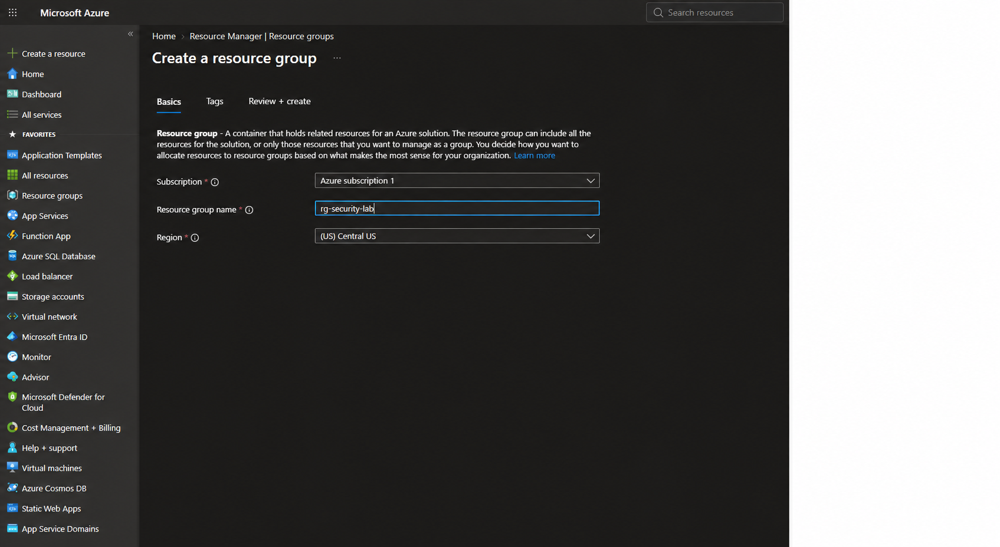
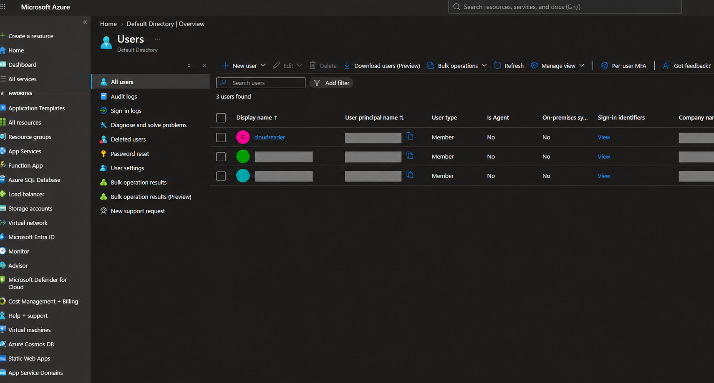
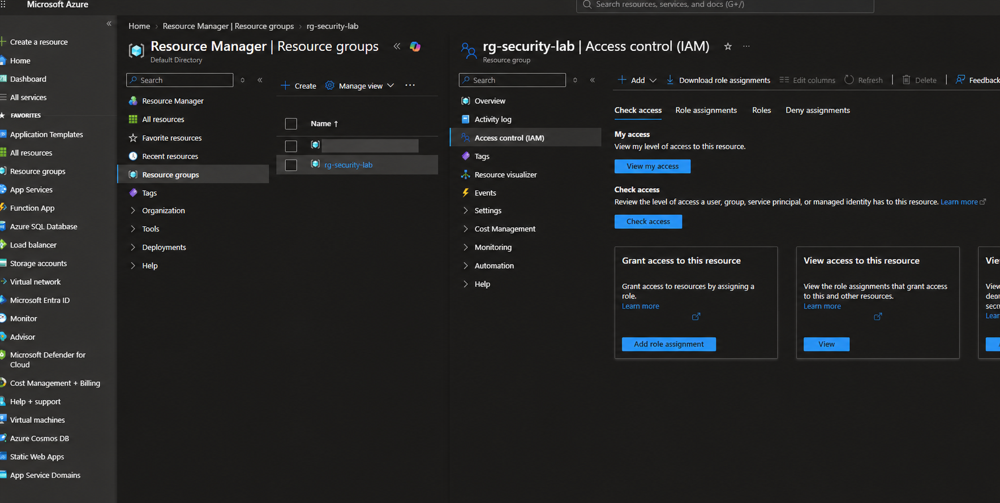
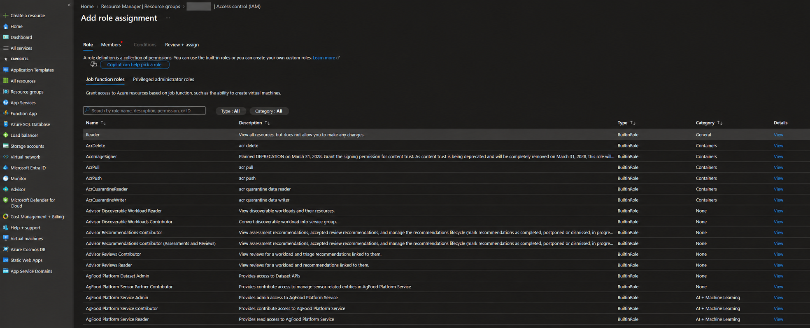
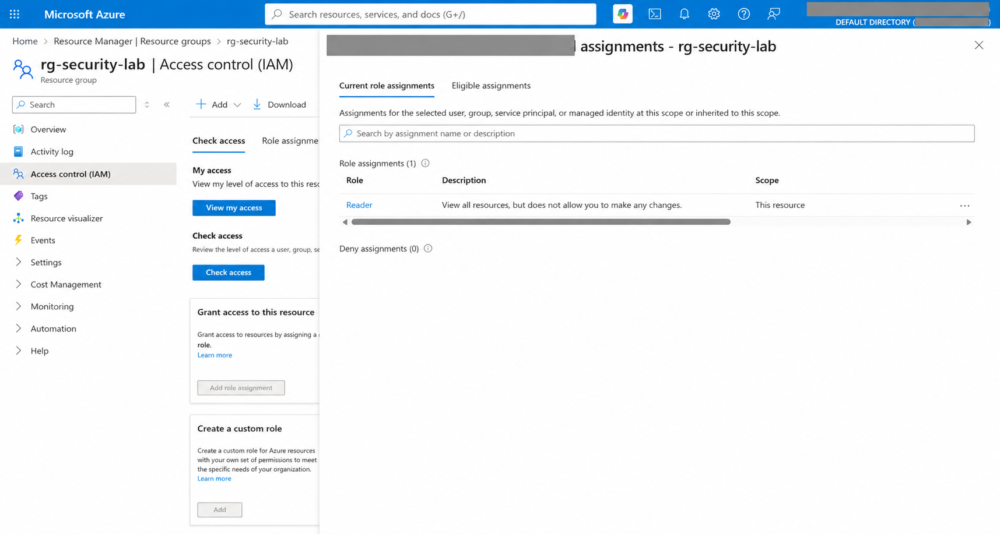
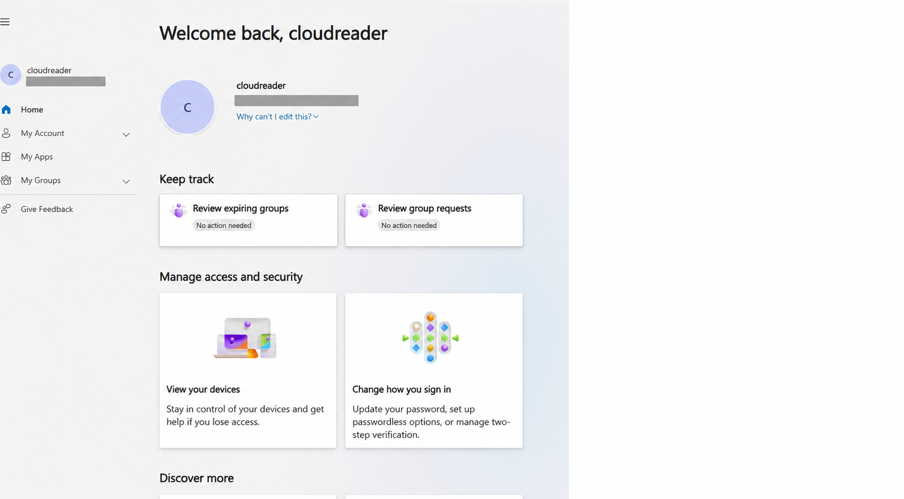
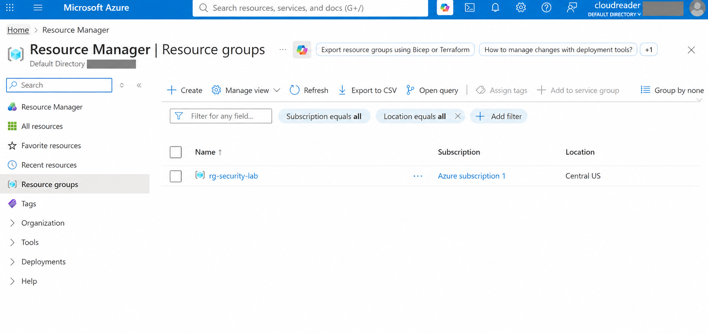
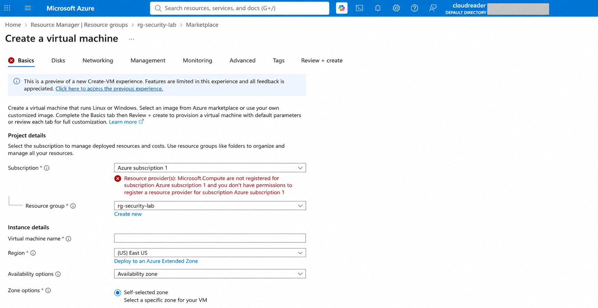
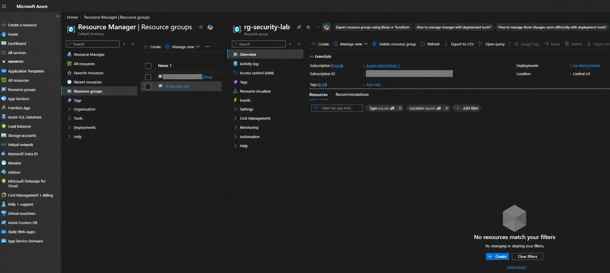

# Azure RBAC Least-Privilege Security Lab


## Project summary

This hands-on cloud-security lab demonstrates how to restrict a Microsoft Entra ID test user to read-only access on one Azure resource group. I created the user, assigned the built-in **Reader** role at resource-group scope, verified the effective assignment, signed in as the test identity, and tested the access boundary.

The project applies the principle of **least privilege**: an identity receives only the permissions required to complete its task and only at the smallest practical scope.

## Skills demonstrated

- Microsoft Entra ID user administration
- Azure role-based access control (RBAC)
- Resource-group scope management
- Least-privilege access design
- Authentication versus authorization
- Permission validation and troubleshooting
- Secure test-account cleanup

## Environment and cost

| Component | Configuration |
|---|---|
| Cloud platform | Microsoft Azure |
| Identity provider | Microsoft Entra ID |
| Test identity | `cloudreader` |
| RBAC role | Reader |
| Assignment scope | `rg-security-lab` resource group |
| Region | Central US |
| Lab cost | $0; no workload was deployed |

## Access design

```text
Microsoft Entra ID
        |
        v
cloudreader test user
        |
        | Reader role
        v
rg-security-lab
        |
        +-- View resources and configuration
        +-- Cannot create, modify, or delete resources
```

Azure RBAC answers three questions:

- **Who?** The `cloudreader` Microsoft Entra identity.
- **What?** The built-in Reader role, which allows viewing but not changes.
- **Where?** Only the `rg-security-lab` resource group.

## Implementation

### 1. Create the isolated resource group

I created `rg-security-lab` in Central US. Scoping the exercise to a dedicated resource group prevents the test identity from receiving access across the entire subscription.



### 2. Create the test identity

I created a separate Microsoft Entra ID user named `cloudreader`. A dedicated test identity makes it possible to validate the user experience without changing the permissions of an administrator account.



### 3. Open resource-group IAM

From `rg-security-lab`, I opened **Access control (IAM)**. Assigning access here limits the role to this resource group instead of granting subscription-wide permissions.



### 4. Select the Reader role

I selected the built-in **Reader** role. Reader permits control-plane visibility but does not permit resource changes.



### 5. Verify the assignment and scope

Using **Check access**, I confirmed that the test identity had one current role assignment: **Reader**, scoped to **This resource**. This verifies both the role and its boundary.



### 6. Sign in as the test user

I used a separate browser session to sign in as `cloudreader`. Separate sessions prevent an administrator's cached token from affecting the test.



### 7. Validate read access

The test identity could locate and view `rg-security-lab`, confirming that the Reader assignment had propagated and that the user was operating in the correct tenant and subscription.



### 8. Test a write operation

I attempted to begin a virtual-machine deployment. Azure displayed that `Microsoft.Compute` was not registered and that the test user did not have permission to register the provider. The result is consistent with the Reader role's inability to perform write operations.



> **Evidence note:** This screenshot contains two related conditions: the resource provider was unregistered, and the Reader identity lacked permission to register it. It demonstrates a blocked write path, but it is not a clean single-cause `AuthorizationFailed` test of VM creation. A stronger follow-up would register `Microsoft.Compute` with an authorized account first, retry the write action as `cloudreader`, and capture the resulting authorization event in the Azure Activity Log.

### 9. Confirm no resource was deployed

The resource group remained empty, so the access test did not create billable infrastructure.



## Troubleshooting approach

If the Reader user cannot see the resource group, I would check:

1. The user is signed into the correct tenant and subscription.
2. The role was assigned to the intended identity.
3. The assignment scope is `rg-security-lab`, not another resource group.
4. **IAM > Check access** shows the expected effective role.
5. The user has signed out and back in to refresh the access token.
6. Enough time has passed for the new assignment to propagate.
7. The Azure Activity Log shows authorization failures or policy blocks.

## Security lessons learned

- Resource-group scope is safer than subscription scope when access is needed for only one workload.
- Reader is preferable to Contributor or Owner when a user only needs visibility.
- Authentication proves identity; Azure RBAC controls authorization after sign-in.
- Effective access should be tested from the restricted identity's session.
- Error messages must be interpreted carefully because multiple configuration and permission issues can appear together.
- Screenshots intended for public repositories should redact UPNs, tenant domains, subscription IDs, and unrelated resource names.

## Cleanup

After testing:

1. Remove the Reader role assignment from `cloudreader`.
2. Delete the `cloudreader` test user.
3. Delete `rg-security-lab` after confirming it contains no required resources.
4. Verify the user and role assignment no longer appear in Entra ID or IAM.

## Interview talking point

> I built an Azure RBAC lab to demonstrate least privilege. I created a Microsoft Entra test user, assigned the Reader role only at resource-group scope, verified effective access, and tested the account in a separate session. The user could view the resource group but could not perform the write operation. I also analyzed the error carefully and identified that provider registration and RBAC permissions both contributed to the result.

## Repository structure

```text
Azure-RBAC-Least-Privilege-Lab/
├── README.md
├── SECURITY.md
├── docs/
│   └── improvement-plan.md
└── images/
    ├── 01-create-resource-group.png
    ├── 02-create-test-user.png
    ├── 03-open-resource-group-iam.png
    ├── 04-select-reader-role.png
    ├── 05-verify-reader-assignment.png
    ├── 06-test-user-sign-in.png
    ├── 07-reader-can-view-resource-group.png
    ├── 08-write-action-blocked.png
    └── 09-resource-group-overview.png
```

